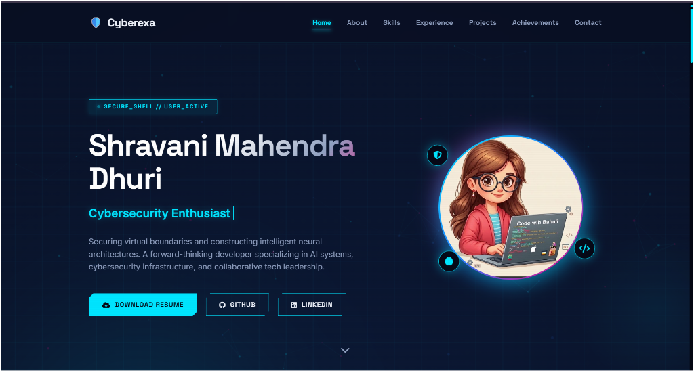
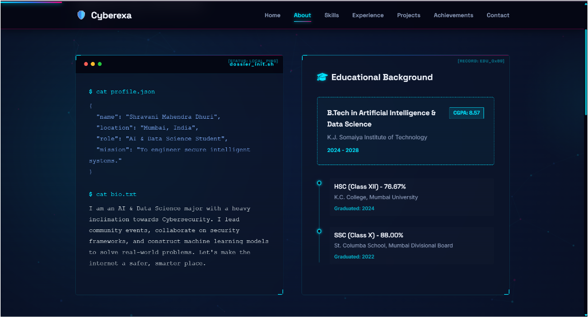
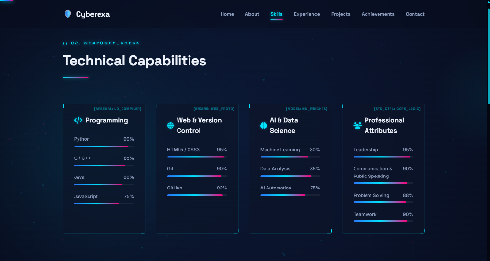
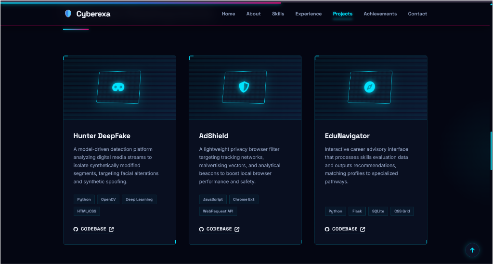
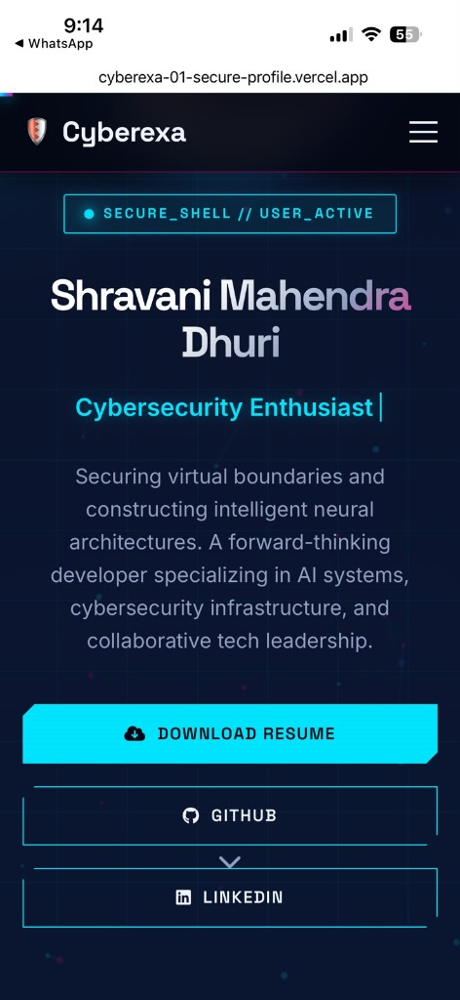

# Cyberexa - Premium Cybersecurity Portfolio


An award-winning cybersecurity-themed personal portfolio website built for **Shravani Mahendra Dhuri** (AI & Data Science Undergraduate & Cybersecurity Enthusiast).

**Live Deployment URL**: [https://cyberexa-01-secure-profile.vercel.app/](https://cyberexa-01-secure-profile.vercel.app/)

This portfolio features a dark, futuristic cyberpunk design system combining glassmorphism grids, glowing border elements, and responsive layout structures.

## 🛡️ Design Language & Theme

- **Background**: Space Obsidian (`#070B1A`) with dynamic radial gradients and grid overlays.
- **Primary Color**: Neon Cyan (`#00E5FF`) with glow values.
- **Secondary Colors**: Blue gradients (`#2979FF` to `#00E5FF`).
- **Typography**:
  - Headings: `Space Grotesk` (Google Font)
  - Body Copy: `Inter` (Google Font)
- **Aesthetic Attributes**: Glassmorphism cards (`backdrop-filter` blur), paper-thin neon glowing outlines, tech-terminal sections, and interactive particle connections.

---

## ⚡ Key Visual Features

- **Cyber Grid Overlay**: An underlying modular coordinate grid styled entirely via pure CSS linear gradients.
- **Mouse Parallax Particles**: Canvas-based particle web system that drifts dynamically and repels slightly upon mouse proximity coordinate overlaps.
- **Cursor Glow Aura**: Custom CSS/JS radial neon pointer background element that follows cursor trajectories.
- **Typewriter Title**: Smooth, automated typing script displaying core subtitles in the Hero container.
- **Fade-Up Observer**: Intersection Observer monitoring page scroll events to slide elements into view sequentially.
- **Numerical Stats Increment**: Dynamic counter increments for achievements when scrolled into viewport targets.
- **Glass Contact Terminal**: Form verification simulating cryptographic payload delivery upon submission.
- **Navbar Scroll Progress & Indicator**: Header border adjustment on scroll alongside a precise viewport scroll progress tracker at the top.

---

## 🎨 Interface Gallery

### Desktop View
#### 1. Home Dashboard


#### 2. About & Cybersecurity Skills Roadmap


#### 3. Core Technical Capabilities


#### 4. Featured Project Deployments


### Mobile View


---

## 📁 File Structure

```text
├── index.html          # Semantic HTML layout with SEO and OG tagging
├── style.css           # Layouts, design tokens, responsiveness, and keyframes
├── script.js           # Particles canvas, typewriter, counters, and scroll listeners
├── resume.pdf          # Downloadable resume document
├── SECURITY.md         # Security disclosure policies and vulnerability instructions
├── README.md           # Technical project information with preview showcase
└── images/
    ├── profile.jpg     # User profile avatar image
    ├── home_desktop.png   # Home dashboard preview
    ├── about_desktop.png  # About & roadmap preview
    ├── skills_desktop.png # Skills progress preview
    ├── projects_desktop.png # Projects showcase preview
    └── mobile_view.jpg # Mobile viewport interface preview
```

---

## 🚀 Execution Instructions

This portfolio has been engineered with zero runtime frameworks or styling scripts to ensure maximum performance and high lighthouse metrics. 

### Local Deployment
To run the portfolio locally, simply open the `index.html` file in any modern web browser, or serve it using a local developer utility:

```bash
# Example serving via Python's standard library
python -m http.server 8000
```
Then visit `http://localhost:8000` in your web browser.
